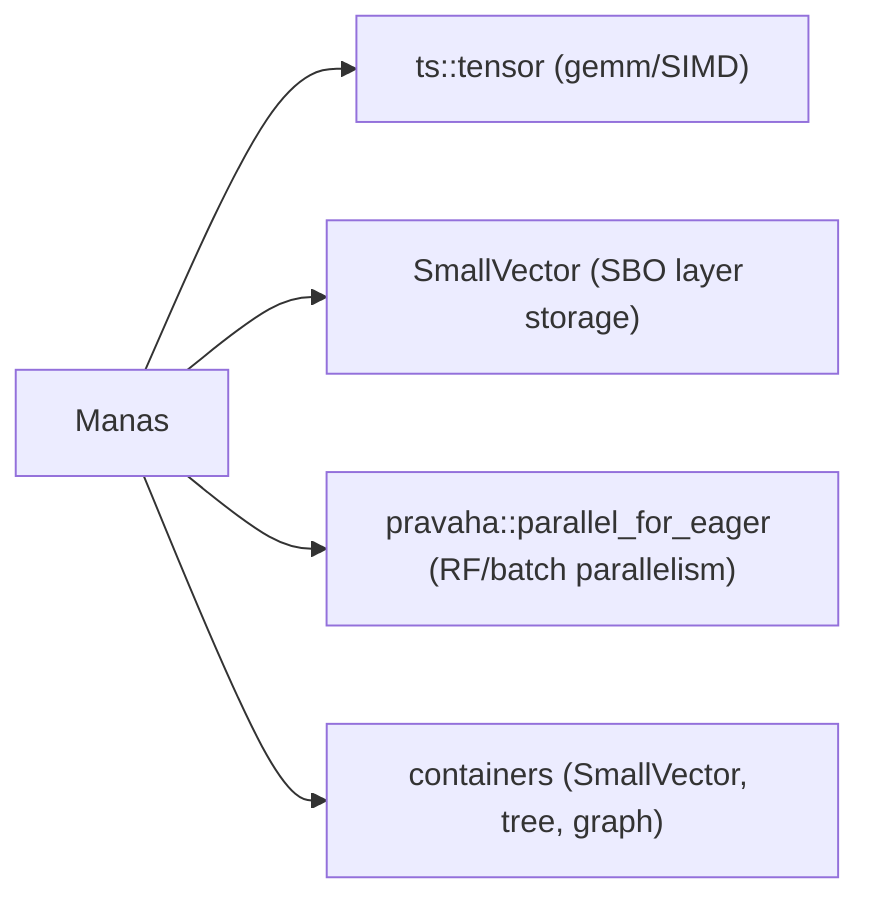
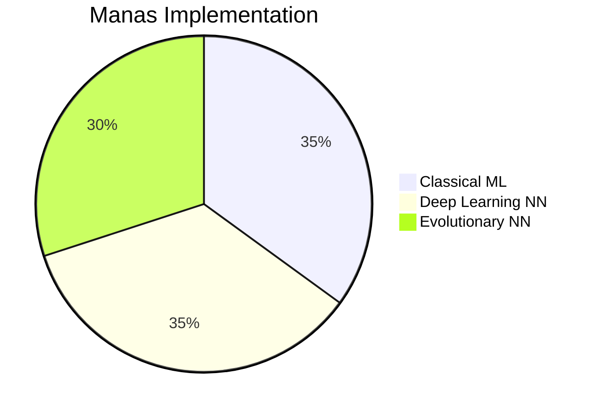

# Manas — ML + Neural Cognition Library

Full-stack C++23/26 machine learning library. Three pillars:

1. **Classical ML** (`manas/ml/`) — SVM, KMeans, KNN, linear models, decision trees, random forests, naive Bayes, PCA
2. **Deep Learning** (`manas/nn/`) — reverse-mode autodiff, layers, optimizers, loss functions
3. **Evolutionary NN** (`manas/`) — genetically encoded neural brains for digital organisms

## Design Principles

- Header-only, zero-overhead
- No virtual functions, no macros
- Policy-based design — swap kernel / criterion / activation / optimizer at compile time
- C++23 concepts enforce interfaces
- Reuses pebble internals: `ts::tensor` (gemm/SIMD), `containers::dynamic::SmallVector` (SBO),
  `pravaha::parallel_for_eager` (batch parallelism), `ga::Dual` (forward autodiff)

---

## Classical ML (`include/manas/ml/`)

### Linear Models

```cpp
#include <manas/ml/ml.hpp>
using namespace manas::ml;

// OLS regression (normal equations, Gauss elimination)
LinearRegression<> reg(/*lambda=*/0.0f);   // plain OLS
LinearRegression<> ridge(10.0f);            // ridge regression
reg.fit(X, y);
auto pred = reg.predict(X_test);

// Logistic regression (gradient descent, L2 regularisation)
LogisticRegression lr(/*lr=*/0.1f, /*epochs=*/500, /*lambda=*/0.01f);
lr.fit(X, y);                              // y in {0, 1}
auto classes = lr.predict(X_test);
auto probs   = lr.predict_proba(X_test);
```

### SVM

```cpp
// Policy: LinearKernel | PolynomialKernel | RBFKernel | SigmoidKernel
SVM<RBFKernel> svm(/*C=*/1.0f, /*tol=*/1e-3f, /*max_iter=*/1000, RBFKernel{0.5f});
svm.fit(X, y);                            // y in {-1, +1}
auto labels = svm.predict(X_test);
auto df     = svm.decision_function(X_test);
auto n_sv   = svm.n_support_vectors();
```

SMO (Sequential Minimal Optimization) training.

### K-Means

```cpp
// Policy: RandomInit | KMeansPPInit
KMeans<KMeansPPInit> km(/*k=*/3, /*max_iter=*/300, /*tol=*/1e-4f, /*seed=*/42);
km.fit(X);
auto centers = km.cluster_centers();       // [k, features]
auto labels  = km.labels();               // SmallVector<size_t>
auto inertia = km.inertia();
auto assign  = km.predict(X_test);
```

Lloyd's algorithm + optional KMeans++ init.

### KNN

```cpp
// Policy: L2Distance | L1Distance
KNNClassifier<L2Distance> knn(/*k=*/5);
KNNRegressor<>            knr(3);
knn.fit(X_train, y_train);
auto pred = knn.predict(X_test);
```

### Naive Bayes

```cpp
GaussianNaiveBayes gnb(/*var_smoothing=*/1e-9f);
gnb.fit(X, y);
auto classes = gnb.predict(X_test);
auto proba   = gnb.predict_proba(X_test);
```

### Decision Trees

```cpp
// CriterionPolicy: GiniCriterion | EntropyCriterion | MSECriterion
DecisionTreeClassifier dt(/*max_depth=*/10, /*min_samples_split=*/2, /*min_samples_leaf=*/1);
DecisionTreeRegressor  dtr(8, 2, 1);
dt.fit(X, y);
auto pred = dt.predict(X_test);
```

CART algorithm with Gini / Entropy / MSE impurity.

### Random Forest

```cpp
// FeatPolicy: SqrtFeatures | LogFeatures | AllFeatures
RandomForestClassifier rf(/*n_trees=*/100, /*max_depth=*/8, /*min_split=*/2, /*seed=*/42);
RandomForestRegressor  rfr(50, 6, 2, 0);
rf.fit(X, y);
auto pred = rf.predict(X_test);
auto n    = rf.n_estimators();
```

Bootstrap + feature subsampling. Parallel tree training via `pravaha::parallel_for_eager`.

### PCA

```cpp
PCA pca(/*n_components=*/10);
pca.fit(X);
auto X_reduced   = pca.transform(X);
auto X_rt        = pca.fit_transform(X);
auto components  = pca.components();      // [n_components, features]
auto expl_var    = pca.explained_variance();
```

Power iteration deflation for top-k eigenvectors.

### Concepts & Kernels

```cpp
// Compile-time enforcement
static_assert(manas::ml::Estimator<LinearRegression<>>);
static_assert(manas::ml::Kernel<RBFKernel>);

// Available kernels
LinearKernel      {}              // k(a,b) = dot(a,b)
PolynomialKernel  {degree, c, g}  // k(a,b) = (g*dot+c)^d
RBFKernel         {gamma}         // k(a,b) = exp(-γ‖a-b‖²)
SigmoidKernel     {alpha, beta}   // k(a,b) = tanh(α·dot+β)
```

---

## Deep Learning (`include/manas/nn/`)

### Reverse-Mode Autodiff

```cpp
#include <manas/nn/nn.hpp>
using namespace manas::nn;

// Thread-local tape — records operations automatically
TensorVar x(Tensor({2}, {3.0f, 4.0f}), /*requires_grad=*/true);
TensorVar y(Tensor({2}, {1.0f, 2.0f}), true);

auto z = mul(x, y);          // registered on tape
auto s = sum_all(z);

Tape::current().backward(s.tape_id);   // reverse pass

x.grad();  // tensor holding dx
y.grad();  // tensor holding dy

// Disable gradient tracking
{
    NoGradGuard ng;
    auto out = relu(x);     // tape_id == Tape::kNoGrad
}
```

**Available ops**: `add`, `mul`, `matmul`, `add_bias`, `scale`, `sum_all`, `mean_all`  
**Activations**: `relu`, `sigmoid`, `tanh_op`, `gelu`, `softmax`, `log_softmax`, `elu`, `leaky_relu`

### Initializers

```cpp
ZerosInit{}({shape})
OnesInit{}({shape})
NormalInit{mean, stddev, seed}({shape})
UniformInit{lo, hi, seed}({shape})
GlorotUniformInit{seed}({in, out})    // limit = sqrt(6/(fan_in+fan_out))
HeNormalInit{seed}({in, out})          // std = sqrt(2/fan_in)
OrthogonalInit{gain, seed}({n, m})    // Gram-Schmidt QR
```

### Layers

#### Dense

```cpp
// ActPolicy: ActivationNone | ActivationReLU | ActivationSigmoid
//            ActivationTanh | ActivationGELU | ActivationSoftmax
// WInit, BInit: any Initializer policy
Dense<ActivationReLU, GlorotUniformInit, ZerosInit> layer(in, out, use_bias, "name");
auto y = layer.forward(x, training);   // x: [N, in] -> [N, out]
auto params = layer.parameters();      // ParamList = SmallVector<Parameter*>
```

#### BatchNorm1D

```cpp
BatchNorm1D bn(num_features, /*eps=*/1e-5f, /*momentum=*/0.1f);
auto y = bn.forward(x, training);     // full forward + backward (gamma, beta, x)
```

#### LayerNorm

```cpp
LayerNorm ln(normalized_shape, eps);
auto y = ln.forward(x, training);
```

#### Dropout

```cpp
Dropout drop(/*p=*/0.5f, /*seed=*/42);
auto y = drop.forward(x, training);   // inverted dropout, identity in eval mode
```

#### Embedding

```cpp
Embedding emb(vocab_size, embed_dim);
// x: [N] integer indices as float -> [N, embed_dim]
auto y = emb.forward(x_indices, training);
```

### Loss Functions

```cpp
mse_loss(pred, target)         // mean squared error
mae_loss(pred, target)         // mean absolute error
huber_loss(pred, target, d)    // smooth L1
bce_loss(pred, target)         // binary cross-entropy (pred in (0,1))
cross_entropy_loss(logits, y)  // multiclass (uses log_softmax internally)
nll_loss(log_probs, y)         // negative log likelihood
hinge_loss(pred, target)       // SVM-style (target in {-1,+1})
kl_div_loss(log_p, q)          // KL divergence
```

All return scalar `TensorVar`, fully differentiable.

### Optimizers

```cpp
// ClipPolicy: NoClip | GlobalNormClip{max_norm}
SGD<>     sgd(lr, momentum=0.0f, nesterov=false, weight_decay=0.0f);
Adam<>    adam(lr=1e-3f, beta1=0.9f, beta2=0.999f, eps=1e-8f, wd=0.0f);
AdaGrad<> ada(lr, eps);
RMSProp<> rms(lr, alpha=0.99f, eps=1e-8f, momentum=0.0f);
AdamW<>   adamw(lr, beta1, beta2, eps, weight_decay);

// With gradient clipping:
Adam<GlobalNormClip> adam_clip(0.001f, {}, {}, {}, {}, GlobalNormClip{1.0f});

sgd.zero_grad(params);
Tape::current().backward(loss.tape_id);
sgd.step(params);
```

### Sequential Model

```cpp
Sequential net;
net.add(Dense<ActivationReLU>(784, 256, true, "fc1"))
   .add(BatchNorm1D(256))
   .add(Dropout(0.3f))
   .add(Dense<ActivationReLU>(256, 128, true, "fc2"))
   .add(Dense<ActivationNone>(128, 10, true, "out"));

// Forward
auto pred = net.forward(x, /*training=*/true);

// Training step (forward + backward + optimizer update)
Adam<> opt(1e-3f);
float loss = train_step(net, x, y_true,
    [](const TensorVar& p, const TensorVar& t) { return cross_entropy_loss(p, t); },
    opt, /*reset_tape=*/true);

// Inference (NoGradGuard applied automatically)
auto logits = predict(net, x);

// Parameters
auto params = net.parameters();      // SmallVector<Parameter*>
size_t n = net.num_layers();
```

`LayerHolder` is type-erased via `std::function` + `shared_ptr<L>` — zero vtable, inline SBO for small layers.

---

## Evolutionary Neural Cognition (`include/manas/`)

```cpp
#include <manas/manas.hpp>   // includes all three pillars

// Genome-based network
BrainGenome brain = { .topology_type = TopologyType::FeedForward,
                      .weights = ts::tensor<float>({2,2}, {0.4f,-0.3f,0.2f,0.5f}),
                      .biases  = ts::tensor<float>({2}, {0.1f,0.0f}) };

// Evolutionary operators (policy-based)
EvolutionaryProcess<TournamentSelection, GaussianJitterMutation, UniformCrossover> evo;
evo.run_generation();
```

---

## Integration Map



## Implementation Status



All three pillars fully implemented and tested.
