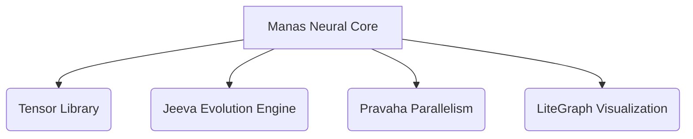
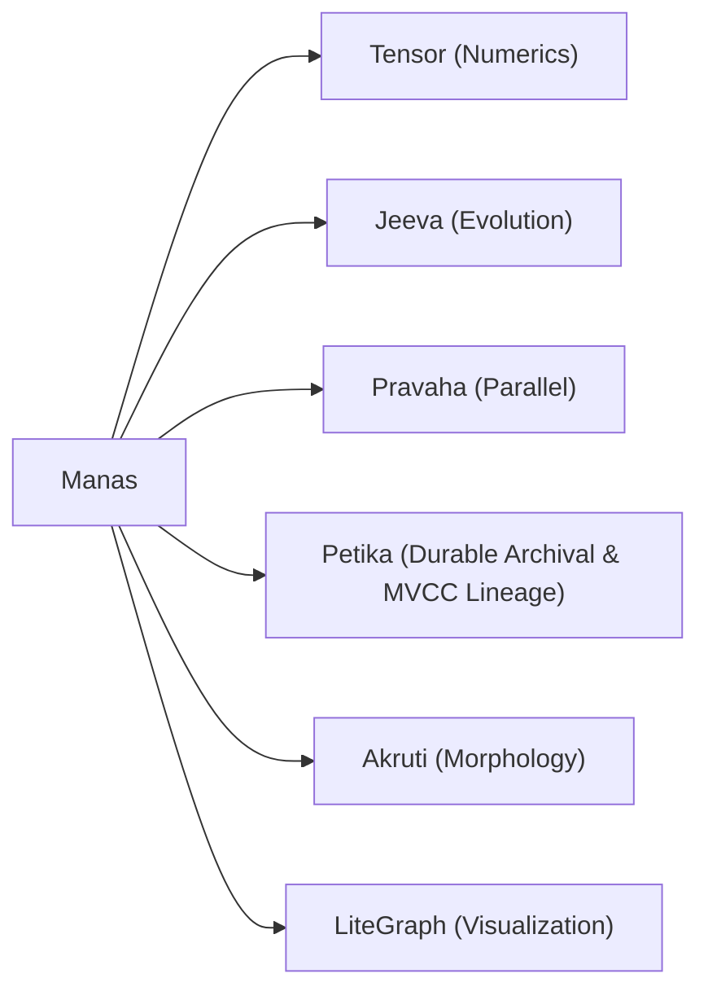
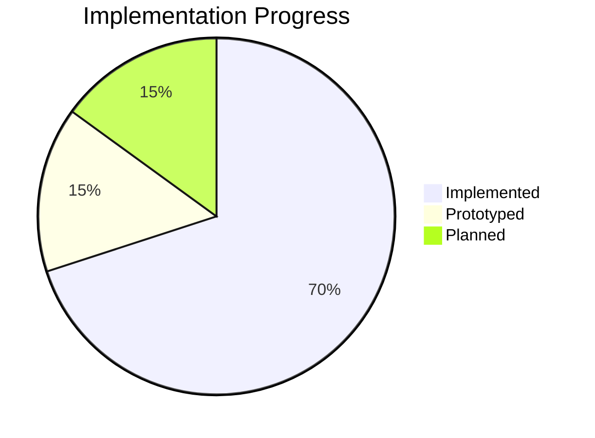

# Manas - Evolutionary Neural Cognition Library

## Purpose
Genetically encoded neural brains for evolving digital organisms.

**Not**: Machine learning framework, Deep learning framework, Reinforcement learning framework.

## Design Goals
1. Neural inference
2. Neural genomes
3. Mutation
4. Reproduction
5. Memory
6. Cognitive evolution

## Core Technologies


## Neural Architecture
### Brain Identifiers
```cpp
#include <manas/brain.hpp>

BrainId id = {.value = 0xCAFEBABE};  // 64-bit stable ID
NeuronIndex neuron = {.value = 42};    // 32-bit neuron reference
```

### Topology Types
```cpp
enum class TopologyType {
    Reactive,     // Direct input→output
    FeedForward,  // Layered: input→hidden→output
    Recurrent,    // Hidden↔︎hidden connections
    Evolvable     // NEAT-inspired dynamic structure
};
```

### Activation Functions
```cpp
#include <manas/activation.hpp>

// Supported activations:
Identity  // f(x)=x
Sigmoid   // 1/(1+e^{-x})
Tanh      // tanh(x)
ReLU      // max(0,x)
LeakyReLU // max(αx,x)
SoftSign  // x/(1+|x|)
```

## Evolutionary System
### Brain Genome
```cpp
struct BrainGenome {
    TopologyType topology_type;
    ts::tensor<float> weights;  // SIMD-accelerated
    ts::tensor<float> biases;
    uint64_t generation;
    BrainId parent_id;          // Lineage tracking
};

// Example genome:
BrainGenome proto_brain = {
    .topology_type = TopologyType::Reactive,
    .weights = ts::tensor<float>({2,2}, {0.4, -0.3, 0.2, 0.5}),
    .biases = ts::tensor<float>({2}, {0.1, 0.1}),
    .generation = 1,
    .parent_id = {0}
};
```

### Evolutionary Process
```cpp
template<typename Selection, typename Mutation, typename Crossover>
class EvolutionaryProcess {
public:
    void run_generation() {
        // TODO: Implement evolutionary loop
        // Parallelized with Pravaha
    }

private:
    tsa::slot_map<BrainGenome> population;  // (Planned) Efficient storage
    tsa::SmallVector<MutationOperator, 4> mutators;  // (Planned) Mutation pipeline
};
```

## Performance Characteristics
| Feature | Advantage |
|---------|-----------|
| Header-only | Zero-link cost |
| Tensor-backed | Automatic SIMD/GPU acceleration |
| Arena-compatible | No heap fragmentation |
| Policy-based evolution | Custom selection mechanisms |

## Integration Map


## Development Status


## Future Roadmap
1. Neural network forward pass implementation (Implemented)
2. Non-linear activation functions (Implemented)
3. Policy-based evolutionary loop with selection, mutation, crossover (Implemented)
4. Petika-backed durable genome archival & lineage snapshots (Implemented)
5. Pravaha-based parallel evolution (Implemented)
6. NEAT-inspired evolvable dynamic topology
7. LiteGraph-powered brain visualization
8. Thermodynamic memory models

## Example Evolutionary Simulation
```cpp
manas::EvolutionaryProcess process;
for (int gen = 0; gen < 1000; ++gen) {
    process.run_generation();
    // Planned visualization output
    // manas::NetworkVisualizer::export_graphviz(best, "best-gen-${gen}.dot");
```