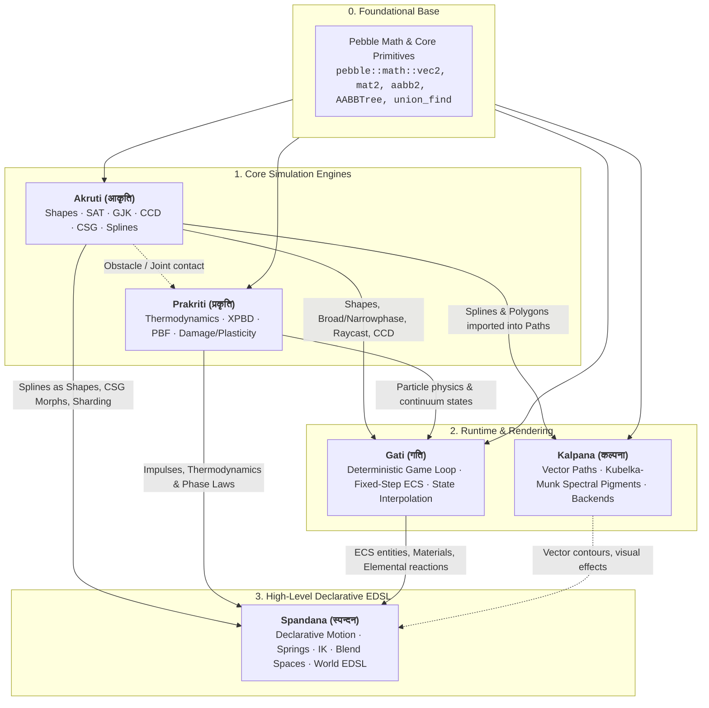

# Spandana (स्पन्दन) — Universal Visual, Motion, Shape, Effect & Physics EDSL Engine

Header-only C++23/C++26. No virtual, no macros. Contract-based static policy dispatch.
Spandana is the high-level declarative visual, physical, and motion language for Pebble, combining 2D Animation, Easing, Harmonic Springs, Inverse Kinematics, Flipbooks, Akruti CSG Shape Morphs, Akruti Splines as first-class geometric shapes, Prakriti Physics Impulses, Procedural Voronoi Destruction, Parametric 2D Directional Blend Spaces, Material Thermodynamics & Phase Transitions (Solid/Liquid/Gas/Plasma), Particle Emitters, and Node-Based Dependency Inference.

Include: `#include <spandana/spandana.hpp>`

## Table of Contents
1. [Subsystem Ecosystem & Dependencies](#1-subsystem-ecosystem--dependencies)
2. [Core Strengths](#2-core-strengths)
3. [Core Architecture](#3-core-architecture)
4. [Quick Start Example](#4-quick-start-example)

---

## 1. Subsystem Ecosystem & Dependencies

Spandana sits as the high-level orchestration, declarative EDSL, and motion language uniting Pebble's foundational math, geometry, physics, graphics, and runtime systems:



---

## 2. Core Strengths

| Library | Sanskrit Meaning | Domain / Core Strength | Key Capabilities |
| :---| :---| :---| :---|
| **`Akruti`** | आकृति (*Shape / Form*) | **2D Geometry, Collision Narrowphase & CSG** | • Zero-heap analytical SDFs & 2-point SAT contact manifolds for stacking.<br>• Zero-heap Expression EDSL CSG (`\|`, `&`, `-`) & Flat AST Arena.<br>• Google Highway SIMD sweeps & Voronoi fracture/tear pipeline (*Khanda*). |
| **`Prakriti`** | प्रकृति (*Matter / Nature*) | **Continuum Multi-Physics & Material-State Simulation** | • Hybrid Lagrangian particle-field simulator.<br>• Continuous 4-fraction thermodynamics `{solid, plastic, liquid, gas}` + Tait EOS.<br>• XPBD mechanics, Position-Based Fluids (PBF), graph-Laplacian heat diffusion, strain damage/plasticity.<br>• Stride-1 SoA columns with SIMD & Pravaha multi-core task graphs. |
| **`Kalpana`** | कल्पना (*Imagination / Visual Art*) | **2D Vector Graphics & Spectral Pigment Mixing** | • **Kubelka-Munk subtractive spectral mixing** (physically accurate pigment mixing vs. muddy RGB).<br>• Vector paths (`CubicBezierCurve`, `CatmullRomSpline`, `Poly` interop) & brush dynamics.<br>• Headless software rasterizer, GPU (Sokol), and terminal (Notcurses) backends. |
| **`Gati`** | गति (*Motion / Gait*) | **Deterministic Game Loop & ECS Runtime Orchestration** | • Fixed-step scheduler with presentation render interpolation (`alpha`).<br>• Manages gameplay systems over `pebble::ecs`.<br>• Bridges geometry (Akruti) and physics (Prakriti) into game entities. |
| **`Spandana`** | स्पन्दन (*Pulse / Vibration*) | **Universal Visual, Motion, Effect & World EDSL** | • Automatic action dependency inference & parallel execution scheduling (`ResourceKey`).<br>• Analytical spring solvers, 2D IK (`TwoBoneIK`, `FABRIK2D`), skeletal FK/LBS, directional blend spaces.<br>• Declarative unified EDSL for motion, particles, camera trauma, thermodynamics, and Voronoi destruction. |

---

## 3. Core Architecture

1. **Automatic Dependency & Parallelism Inference (`ResourceKey`)**:
   - Actions targeting different entities/components automatically run concurrently.
   - Actions targeting the same component field automatically serialize in sequence.
## 1. Core Modules

1. **Easing & Springs (`spandana/easing.hpp`, `spandana/spring.hpp`)**:
   - 32 Robert Penner easing equations (`in_quad`, `out_elastic`, `in_out_bounce`, etc.).
   - Analytical damped harmonic oscillator (`AnalyticalSpringDamper`) with critical, underdamped, and overdamped modes.
2. **Inverse Kinematics (`spandana/ik.hpp`)**:
   - Analytical 2-Bone trigonometric IK solver with reach clamping and elbow flip flags.
3. **Soft-Body Verlet Dynamics (`spandana/cloth.hpp`)**:
   - 2D distance-constrained cloth, hair, and cape dynamics.
   - Conversion to `akruti::ChainShape<N>` via `cloth.to_chain<N>()` for continuous collision & rendering.
4. **Procedural Voronoi Destruction (`spandana/destruction.hpp`)**:
   - Dynamic Voronoi polygon fracture using Akruti clipping with automatic `gati::ShapeRef` and exact mass/inertia tensor computations.
5. **Parametric 2D Directional Blend Spaces (`spandana/blend_space.hpp`)**:
   - Barycentric velocity interpolation between multiple animation clips with phase synchronization.
6. **Declarative Universal EDSL & Timeline (`spandana/edsl/`, `spandana/timeline.hpp`)**:
   - Natural, unified syntax: `tween()`, `follow_path()`, `shake_screen()`, `play_sound()`, `particle_burst()`.
   - Automatic resource dependency inference (concurrent execution of disjoint resources, sequential chaining of shared keys).and brittle fracture on collision.
7. **Elemental & Chemical Reaction Matrix (`gati/elemental.hpp`)**:
   - Automated elemental resolution: Water + Lava $\to$ Obsidian + Steam, Fire + Wood $\to$ Ignition, Acid + Metal $\to$ Corrosion, Electricity + Water $\to$ Shockwaves.
8. **2D Skeletal Hierarchy & Linear Blend Skinning (`spandana/skeleton.hpp`)**:
   - Hierarchical bone forward kinematics (FK) and linear blend skinning (LBS) for mesh contours.
9. **Glaze JSON Serialization (`spandana/serialization.hpp`)**:
   - Ultra-fast reflection-free JSON serialization/deserialization for materials and animation configurations.
10. **Unified Declarative World EDSL**:
   - Motion & Splines: `tween(prop).to(val)`, `spring(prop).target(val)`, `follow_path(pos, spline).orient_to_tangent(rot)`
   - Geometry & Shapes: `shape_fx(circle(10.0f)).grow(2.0f)`, `morph_shape(...)`
   - Physics & Destruction: `radial_impulse().at(pos).magnitude(500.0f)`, `shatter_entity(e).at(impact).shards(8)`
   - Thermodynamics & Materials: `set_material(e, Ice()).temperature(-15)`, `apply_heat().at(pos).temperature(500)`
   - Particles & Effects: `particle_burst().at(pos).count(32)`, `shake_camera(cam).trauma(0.7f)`, `flipbook(sprite).play("attack")`

---

## 4. Quick Start Example

```cpp
#include <spandana/spandana.hpp>
#include <gati/material.hpp>

using namespace pebble::spandana::edsl;
using namespace pebble::spandana::ease;

pebble::spandana::Timeline timeline;

// Intuitive declaration: non-conflicting actions run in parallel; conflicting actions serialize automatically!
timeline.add(
    // 1. Assign Ice material to entity
    set_material(world, obstacle_entity, gati::MaterialComponent::Ice()).temperature(-10.0f),

    // 2. Apply heat source in the world -> heats ice above 0°C (melts into liquid) and 100°C (vaporizes to gas)
    apply_heat(world).at({50.0f, 0.0f}).temperature(350.0f).radius(80.0f).duration(1.0f),

    // 3. Shake camera and burst steam particles
    shake_camera(camera).trauma(0.6f).duration(0.3f),
    particle_burst().at({50.0f, 0.0f}).count(40).speed(80.0f, 200.0f).lifetime(0.5f)
);

// In your game loop:
timeline.update(dt);
```
