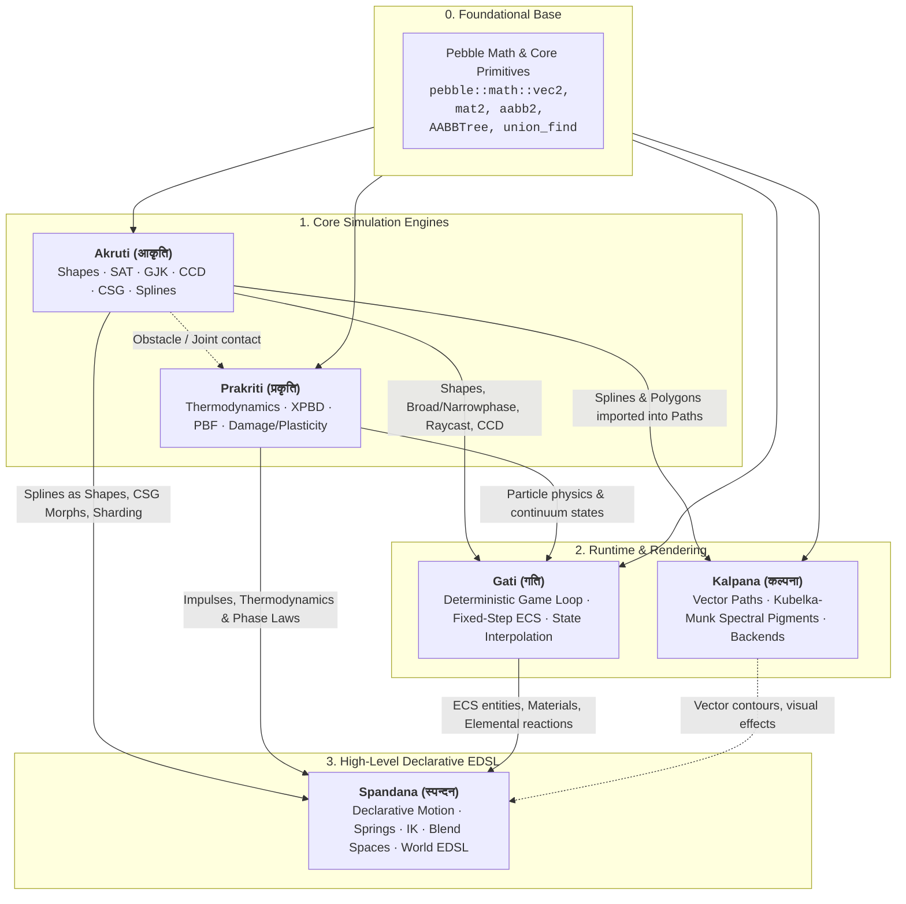

# Spandana (स्पन्दन) — Universal Visual, Motion, Shape, Effect & Physics EDSL Engine

Header-only C++23/C++26. No virtual dispatch, no macros. Contract-based static policy dispatch.
Spandana is the high-level declarative visual, physical, and motion orchestration language for Pebble, combining 2D Animation, 32+ Robert Penner Easings, Exact Analytical Harmonic Springs, Inverse Kinematics (`TwoBoneIK`, `FABRIK2D`), 2D Verlet Cloth/Cape Dynamics, Akruti CSG Shape Morphs, Prakriti Multi-Physics Impulses, Procedural Voronoi Destruction, Parametric 2D Directional Blend Spaces, Material Thermodynamics & Phase Transitions, Particle Emitters, and Automatic Resource Dependency DAG Inference (`ResourceKey`).

Include: `#include <spandana/spandana.hpp>`

---

## Table of Contents
1. [Subsystem Ecosystem & Dependencies](#1-subsystem-ecosystem--dependencies)
2. [Core Architecture & Automatic Dependency Inference](#2-core-architecture--automatic-dependency-inference)
3. [Algorithmic Foundations & Mathematical Formulations](#3-algorithmic-foundations--mathematical-formulations)
   - [Exact Closed-Form Damped Harmonic Oscillator](#31-exact-closed-form-damped-harmonic-oscillator)
   - [Analytical Two-Bone & FABRIK 2D Inverse Kinematics](#32-analytical-two-bone--fabrik-2d-inverse-kinematics)
   - [Distance-Constrained Verlet Cloth & Ribbon Dynamics](#33-distance-constrained-verlet-cloth--ribbon-dynamics)
   - [Parametric 2D Directional Blend Spaces](#34-parametric-2d-directional-blend-spaces)
   - [Perlin Camera Shake Trauma & Frequency Decay](#35-perlin-camera-shake-trauma--frequency-decay)
4. [Master Subsystem Catalog & Public API](#4-master-subsystem-catalog--public-api)
5. [Configuration, Defaults & Performance Tuning Guide](#5-configuration-defaults--performance-tuning-guide)
   - [Default Configuration Settings](#51-default-configuration-settings)
   - [How to Optimize Further (Extreme Timeline Throughput)](#52-how-to-optimize-further-extreme-timeline-throughput)
   - [How to Improve Motion Quality & Spring Smoothness](#53-how-to-improve-motion-quality--spring-smoothness)
   - [Configuration Trade-Off Matrix](#54-configuration-trade-off-matrix)
   - [Auto-Sonification (Spandana ⇄ Dhvani)](#55-auto-sonification-spandana--dhvani)
6. [Declarative World EDSL Grammar & Syntax Reference](#6-declarative-world-edsl-grammar--syntax-reference)
7. [Zero-to-Hero Tutorial](#7-zero-to-hero-tutorial)
   - [Step 1: Instantiating the Timeline & Resource Keys](#step-1-instantiating-the-timeline--resource-keys)
   - [Step 2: Composing Parallel & Sequential Motion](#step-2-composing-parallel--sequential-motion)
   - [Step 3: Multi-Bone Inverse Kinematics Targeting](#step-3-multi-bone-inverse-kinematics-targeting)
   - [Step 4: Full World Orchestration (Thermodynamics + Particle Bursts + Camera Trauma)](#step-4-full-world-orchestration-thermodynamics--particle-bursts--camera-trauma)
8. [Pebble Subsystem Reuse](#8-pebble-subsystem-reuse)

---

## 1. Subsystem Ecosystem & Dependencies

Spandana sits as the high-level orchestration, declarative EDSL, and motion language uniting Pebble's foundational math, geometry, physics, graphics, and runtime systems:



> **Engine boundary (single ownership).** Spandana authors *intent* — motion content, choreography,
> and directive DAGs — and **never simulates**. Physics verbs delegate downward: radial/impulse
> forces and thermodynamics to **Prakriti** (`prakriti::World::apply_radial_impulse` on the particle
> store), and shatter geometry + exact mass properties (centroid / area / polar inertia) to **Akruti**
> (`akruti::khanda::fracture_voronoi`). Playback is one-directional **Spandana → Gati**: Spandana
> produces timelines/curves; Gati *executes* them (the player/scheduler owns *when*). Shared math
> primitives (e.g. `catmull_rom`) live in `pebble::math`, consumed by both Akruti splines and Gati
> curves — not re-derived per engine. `ElementalReactionMatrix` is Gati-owned game rules, surfaced to
> Spandana as data. The lumped-scalar conduction model used in gati/spandana choreography is distinct
> from Prakriti's SPH thermal solver (different discretization, not a duplicate) and stays inline.

---

## 2. Core Architecture & Automatic Dependency Inference

Spandana revolutionizes animation management through **compile-time Resource Key inference**:
- Every action automatically derives its `ResourceKey{entity_id, component_type_hash, property_offset}`.
- **Disjoint Keys $\implies$ Concurrent Execution**: Actions modifying different entities or different properties of the same entity execute in parallel without locks.
- **Overlapping Keys $\implies$ Sequential Execution**: Actions targeting the same property are automatically serialized into a FIFO execution queue.

---

## 3. Algorithmic Foundations & Mathematical Formulations

### 3.1 Exact Closed-Form Damped Harmonic Oscillator
Unlike unstable Euler approximations, Spandana solves the continuous ODE $m \ddot{x} + c \dot{x} + k(x - x_t) = 0$ with closed-form analytic integrals:
- Angular Frequency: $\omega_0 = \sqrt{k/m}$, Damping Ratio: $\zeta = \frac{c}{2\sqrt{km}}$
- **Underdamped ($\zeta < 1$)**: Damped frequency $\omega_d = \omega_0 \sqrt{1 - \zeta^2}$:
  $$x(t) = x_t + e^{-\zeta \omega_0 t} \left( (x_0 - x_t) \cos(\omega_d t) + \frac{v_0 + \zeta \omega_0 (x_0 - x_t)}{\omega_d} \sin(\omega_d t) \right)$$
- **Critically Damped ($\zeta = 1$)**:
  $$x(t) = x_t + e^{-\omega_0 t} \left( (x_0 - x_t) + (v_0 + \omega_0 (x_0 - x_t)) t \right)$$
- **Overdamped ($\zeta > 1$)**: Sum of distinct real exponentials $\lambda_{1, 2} = -\omega_0(\zeta \mp \sqrt{\zeta^2 - 1})$.

### 3.2 Analytical Two-Bone & FABRIK 2D Inverse Kinematics
For a 2-segment arm with lengths $l_1, l_2$ from base $P_0$ to target $T$:
$$D = \|T - P_0\| \in [|l_1 - l_2|, l_1 + l_2]$$
$$\cos(\theta_2) = \frac{D^2 - l_1^2 - l_2^2}{2 l_1 l_2}, \qquad \theta_2 = \text{atan2}(\pm \sqrt{1 - \cos^2\theta_2}, \cos\theta_2)$$
$$\theta_1 = \text{atan2}(T_y - P_{0y}, T_x - P_{0x}) - \text{atan2}(l_2 \sin\theta_2, l_1 + l_2 \cos\theta_2)$$

### 3.3 Distance-Constrained Verlet Cloth & Ribbon Dynamics
Particles are integrated without velocity storage using Verlet integration:
$$x_{t+\Delta t} = 2 x_t - x_{t-\Delta t} + a \cdot \Delta t^2$$
Distance constraints are relaxed iteratively:
$$\Delta x = \frac{\|x_a - x_b\| - L_0}{\|x_a - x_b\|} (x_a - x_b), \quad x_a \mathrel{-}= 0.5 \Delta x, \quad x_b \mathrel{+}= 0.5 \Delta x$$
Ribbons convert directly into `akruti::ChainShape<N>` for collision and Kalpana rendering.

### 3.4 Parametric 2D Directional Blend Spaces
Blends animation cycles based on 2D velocity parameters $(v_x, v_y)$ via Delaunay barycentric coordinate interpolation with phase synchronization:
$$W(v) = \sum_{k=1}^3 \lambda_k(v) \cdot \text{Pose}_k(\phi), \qquad \dot{\phi} = \sum_{k=1}^3 \lambda_k(v) \cdot \text{Freq}_k$$

### 3.5 Perlin Camera Shake Trauma & Frequency Decay
Trauma $T \in [0, 1]$ decays linearly over time ($T \leftarrow \max(0, T - r_{\text{decay}} \Delta t)$):
$$\text{Offset}_x = \text{Perlin}(\text{seed}_1, t \cdot \omega) \cdot T^2 \cdot \text{max\_x}$$
$$\text{Offset}_y = \text{Perlin}(\text{seed}_2, t \cdot \omega) \cdot T^2 \cdot \text{max\_y}$$
$$\text{Angle} = \text{Perlin}(\text{seed}_3, t \cdot \omega) \cdot T^2 \cdot \text{max\_angle}$$

---

## 4. Master Subsystem Catalog & Public API

| Header / Module | Key Classes & Functions | Description |
|:---|:---|:---|
| `spandana/easing.hpp` | `ease::in_quad`, `ease::out_elastic`, `ease::in_out_bounce` | 32 standard Penner easing functions. |
| `spandana/spring.hpp` | `AnalyticalSpringDamper`, `AngleSpringDamper`, `.step(pos, vel, target, dt)` | Exact analytical damped harmonic oscillator; angle variant takes the shortest arc across the ±π wrap. Coefficients ($\omega_0, \zeta$) are precomputed once at construction. |
| `spandana/ik.hpp` | `TwoBoneIK`, `FABRIK2D`, `.solve(base, target)` | Analytical and iterative inverse kinematics solvers. |
| `spandana/cloth.hpp` | `ClothVerlet2D`, `.step(dt)`, `.to_chain<N>()` | Verlet distance cloth with Akruti collision conversion. |
| `spandana/destruction.hpp`| `DestructionEngine`, `.shatter(entity, point)` | Procedural Voronoi fracture with exact mass properties. |
| `spandana/blend_space.hpp` | `BlendSpace2D`, `.evaluate(vx, vy)` | Parametric 2D directional blend space. |
| `spandana/skeleton.hpp` | `Skeleton2D`, `.set_bone_pose()`, `.skin()` | Hierarchical 2D skeletal FK and linear blend skinning. |
| `spandana/timeline.hpp` | `Timeline`, `.add(Actions...)`, `.update(dt)` | Multi-track orchestrator with automatic DAG scheduling. Actions are stored via a no-virtual small-buffer type-erased `Action` (inline `InlineBytes` storage, free-function vtable, no heap, no RTTI). |
| `spandana/edsl/audio_policy.hpp` | `auto_sonify(profile)`, `SimProfile`, `NullSonifier`, `DhvaniSonifier`, `sound_palette()` | **Opt-in** Dhvani auto-sonification. A compile-time `Sonifier` policy turns a simulation profile + prakriti material state into the right procedural cue. Default `NullSonifier` is an empty type — zero bytes, zero calls. |

---

## 5. Configuration, Defaults & Performance Tuning Guide

### 5.1 Default Configuration Settings

| Parameter | Component | Default Value | Role / Effect |
|:---|:---|:---|:---|
| `spring_stiffness` | `AnalyticalSpringDamper` | `100.0f` | Spring return force multiplier. |
| `spring_damping` | `AnalyticalSpringDamper` | `10.0f` | Velocity damping rate ($\zeta = c / (2\sqrt{km})$). |
| `stiffness` / `damping` | `AngleSpringDamper` | `180.0f` / `12.0f` | Angular spring defaults; shortest-arc wrapping applied before the analytic step. |
| `trauma_decay_rate` | `CameraTrauma` | `1.5f / s` | Rate of camera shake recovery. |
| `cloth_substeps` | `ClothVerlet2D` | `4` | Constraint relaxation sweeps per frame. |
| `max_active_actions`| `Timeline` | `64` | Inlined action buffer capacity (zero heap allocations). |
| `InlineBytes` | `BasicAction` | `192` | Small-buffer size for the type-erased action; fits every shipped EDSL action (largest is `SetMaterialAction`, 152B). An action larger than this fails a `static_assert` (no silent heap fallback). |
| `master_volume` | `DhvaniSonifier` | `1.0f` | Scales every emitted cue's volume. `NullSonifier` (default) emits nothing. |

### 5.2 How to Optimize Further (Extreme Timeline Throughput)
1. **Leverage Automatic Parallelism**: Group non-conflicting entity tweens into a single `timeline.add(...)` call — Spandana schedules them across Pravaha task threads with zero lock overhead.
2. **Use Analytic Springs over Numeric Integrators**: `AnalyticalSpringDamper` evaluates closed-form equations in $O(1)$ without requiring tiny integration sub-steps.
3. **Use Fixed Ribbon Chains**: Convert Verlet cloth to `akruti::ChainShape<16>` to bypass expensive multi-point arbitrary polygon narrowphase.

### 5.3 How to Improve Motion Quality & Spring Smoothness
1. **Tune Damping Ratio ($\zeta$)**:
   - $\zeta = 1.0$: Critically damped (snappiest UI transitions, zero overshoot).
   - $\zeta = 0.7$: Underdamped with pleasant natural bounce.
2. **Use Quadratic Trauma ($T^2$) for Camera Shake**: Quad-scaled Perlin noise ensures subtle background tremors at low trauma and violent physical impact at high trauma.

### 5.4 Configuration Trade-Off Matrix

| Animation Focus | Solver Selection | Substeps | CPU Cost per Item | Motion Feel |
|:---|:---|:---:|:---:|:---|
| **High-Throughput UI** | Robert Penner Easing | 1 | **$\sim 2\text{ns}$** | Deterministic, smooth curves |
| **Organic Physical Motion** | `AnalyticalSpringDamper` | 1 | **$\sim 8\text{ns}$** | Natural physics responsiveness |
| **Deformable Softbodies** | `ClothVerlet2D` | 4–8 | **$\sim 180\text{ns}$** | Flexible cloth / cape simulation |

---

## 5.5 Auto-Sonification (Spandana ⇄ Dhvani)

Spandana can drive [Dhvani](../dhvani/dhvani.md) procedural audio directly from a simulation, so *the type of simulation decides the sound* — no manually authored cues. This is a **compile-time policy**, not a runtime dependency: the `Sonifier` concept selects the behavior, and the default `NullSonifier` is an empty type that (via `[[no_unique_address]]`) costs **zero bytes** and compiles every sonify call away. Audio is therefore fully opt-in and zero-overhead when unused.

| Piece | Role |
|:---|:---|
| `SimProfile` | The event class being voiced: `Impact`, `Fracture`, `Friction`, `Fluid`, `Thermal`, `Explosion`. |
| `SonifyContext` | Normalized prakriti/gati state: `density`, `temperature`, `pressure` (prakriti) + `intensity` (gati). |
| `sound_palette(profile, ctx)` | The single mapping from `SimProfile` + context → a `SonifyCue` (Dhvani cue name + volume + pitch). Pitch is modulated by the acoustic material derived through `dhvani::from_prakriti_material`. |
| `NullSonifier` | Default policy. Empty, no-op, zero-overhead. |
| `DhvaniSonifier` | Active policy. Holds a `dhvani::SoundBus*` and plays the palette's cue. |
| `auto_sonify(profile)` | Timeline directive builder. `.from(density,temp,pressure).intensity(i).via(sonifier)`. |

```cpp
#include <spandana/edsl/audio_policy.hpp>   // opt-in; NOT pulled by the umbrella
using namespace pebble::spandana::edsl;

dhvani::SoundBus bus;
timeline.add(
    auto_sonify(SimProfile::Fracture)
        .from(/*density*/ 0.9f, /*temp*/ 0.0f, /*pressure*/ 0.2f)
        .intensity(0.95f)
        .via(DhvaniSonifier{&bus}));   // omit .via(...) → NullSonifier, silent & free
```

The cue names live in the shared `dhvani::DhvaniCue` registry (the one spelling of each procedural voice), so the physics collision bridge (`GatiSoundBridge`) and the Spandana palette agree by construction.

---

## 6. Declarative World EDSL Grammar & Syntax Reference

```cpp
using namespace pebble::spandana::edsl;

// Motion & Tweens
tween(position).to({100.0f, 20.0f}).duration(1.0s).ease(ease::out_quad);
spring(scale).target({2.0f, 2.0f}).stiffness(180.0f).damping(14.0f);
follow_path(pos, catmull_rom_spline).duration(3.0s).orient_to_tangent();

// Multi-Physics Impulses & Thermodynamics
apply_heat(world).at(impact_point).radius(6.0f).temperature(1500.0f);
radial_impulse().at(explosion_center).magnitude(1000.0f).radius(10.0f);

// FX & Destruction
shake_camera(camera).trauma(0.8f).duration(0.4s);
particle_burst(particle_buffer).at(pos).count(64).speed(20.0f, 100.0f); // writes into caller-owned buffer
shatter_entity(glass_pane).at(hit_point).shards(12);

// Auto-Sonification (opt-in; drives Dhvani from the simulation profile)
auto_sonify(SimProfile::Fracture).from(density, temp, pressure).intensity(0.9f)
    .via(DhvaniSonifier{&sound_bus});
```

---

## 7. Zero-to-Hero Tutorial

### Step 1: Instantiating the Timeline & Resource Keys
```cpp
#include <spandana/spandana.hpp>

using namespace pebble::spandana;
using namespace pebble::spandana::edsl;
using namespace pebble::spandana::ease;

Timeline timeline;
```

### Step 2: Composing Parallel & Sequential Motion
```cpp
pebble::math::vec2 position{0.0f, 0.0f};
float alpha = 1.0f;

// position and alpha modify different memory addresses -> they run in parallel automatically!
timeline.add(
    tween(position).to({100.0f, 50.0f}).duration(1.2f).ease(out_bounce),
    tween(alpha).to(0.0f).duration(0.8f).ease(in_quad)
);
```

### Step 3: Multi-Bone Inverse Kinematics Targeting
```cpp
TwoBoneIK ik_solver{
    .length1 = 15.0f,
    .length2 = 12.0f,
    .flip_elbow = false
};

// Solve arm pose targeting cursor position
auto result = ik_solver.solve({0.0f, 0.0f}, cursor_pos);
if (result.reachable) {
    float shoulder_angle = result.angle1;
    float elbow_angle    = result.angle2;
}
```

### Step 4: Full World Orchestration (Thermodynamics + Particle Bursts + Camera Trauma)
```cpp
// Declarative combat event
timeline.add(
    // 1. Heat up and melt frozen ice obstacle
    apply_heat(game.world()).at({20.0f, 0.0f}).radius(4.0f).temperature(800.0f).duration(0.5f),

    // 2. Shake the camera with physical trauma
    shake_camera(camera).trauma(0.7f).duration(0.35f),

    // 3. Emit water vapor particle burst
    particle_burst().at({20.0f, 0.0f}).count(48).speed(20.0f, 80.0f).lifetime(0.6f)
);

// In your game loop:
timeline.update(delta_time);
```

---

## 8. Pebble Subsystem Reuse

| Subsystem | Usage in Spandana |
|:---|:---|
| `pebble::math` | `vec2`, `mat2`, `slerp`, `CatmullRomSpline` vector math and interpolation. |
| `akruti` | CSG shape morphs, spline conversion to `ChainShape`, and Voronoi clipping. |
| `prakriti` | Thermodynamic phase transitions, heat propagation, and physical particle impulses. |
| `gati` | ECS entity property bindings and deterministic fixed-clock coordination. |
| `kalpana` | Contour rendering, procedural fills, and Kubelka-Munk pigment animations. |

---

## 9. Non-Linear Camera Trauma & Exact Damped Spring Motion

### 9.1 Visceral Screen-Shake with Perlin Noise ($\text{Trauma}^2$)
Spandana implements Squirrel Eiserloh's non-linear trauma screen shake:
$$\text{Shake} = \text{Trauma}^2 \times \text{MaxOffset} \times \text{Noise}(f \cdot t)$$

```cpp
#include "spandana/spandana.hpp"
#include <iostream>

int main() {
    spandana::CameraShake shake;

    // Trigger severe cosmic impact or supernova blast
    shake.add_trauma(0.85f); // Trauma in [0, 1]

    for (int frame = 0; frame < 60; ++frame) {
        shake.update(0.016f); // Decays trauma over time (trauma -= decay * dt)
        
        pebble::math::vec2 offset = shake.get_offset();
        float angle = shake.get_angle();

        std::cout << "Frame " << frame << " -> Offset: (" << offset[0] << ", " << offset[1] << ") Angle: " << angle << "\n";
    }
}
```

### 9.2 Analytical Harmonic Spring Dynamics (Zero Numerical Drift)
```cpp
#include "spandana/spandana.hpp"

// Critical damped spring (zeta = 1.0, omega = 15 rad/s)
spandana::HarmonicSpring<float> spring{
    .frequency = 15.0f,
    .damping_ratio = 1.0f
};

float position = 0.0f;
float velocity = 0.0f;
float target = 100.0f;

// Exact analytical closed-form evaluation without Euler integration drift
spring.step(position, velocity, target, 0.016f);
```
